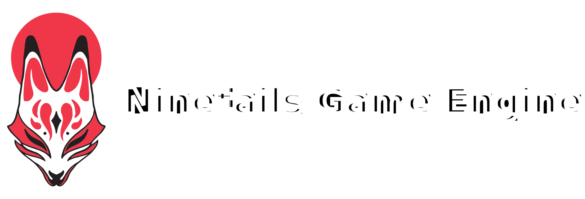

Ninetails is a game engine targeted towards indie game developers and hobbyists alike.
What separates Ninetails from general-purpose game engines is that it targets developers who
want deeper control over how their engine behaves. This is accomplished by presenting a
set of low-level platform APIs which can be used to develop higher order game engine components.
Such components are provided for use, but are not required to develop with Ninetails. For those who
want a fresh project but do not want to trudge through the grunt work of developing
the platform abstractions needed to work with the hardware will be right at home with
this game engine since most of that work is done for you.

This engine has two goals in mind. The first is software quality. User experience and
responsive behavior is a critical aspect of this engine, so careful work has been made
to make this process easier for the developer. Secondly, this engine makes zero assumptions
about what you intend to do with it. Think of it like a framework; how much of a game engine
you want is entirely dependent on how much of the engine you intend to use. You could,
in theory, develop your own engine libraries and with the provided platform abstractions to
tailor fit the engine that fits your needs.

Ninetails is also free to use with the MIT license. If you intend to use Ninetails,
in a commercial project, *please* credit all major contributors in the credits of the
game. You are not required to do so, but it would be very kind of you to do so.

# Getting Started

This project is written using the C-programming language.

Developing a game with Ninetails is not like Unity, Godot, or Unreal. The game
is designed to be directly coupled with the engine. There is no "create new project" button. Simply
clone the project and begin programming.

In order to main modularity between Ninetails and your game, organize and modify
`src/engine/runtime.h` and `src/engine/runtime.c` such that it forwards off your
render and update functionality to a separate implementation file. I recommend creating
a folder like `src/game/` which contains all your game source files. This indirection
will help make it easier to get newer version of Ninetails without having to reintegrate
your game's source code.

Due to the nature of how Ninetails works, you will be tempted to modify core platform
APIs found in `src/platform/`. This is absolutely fine to do, but be warned that collecting
updates from the project repository will become difficult. You should expect API
breaking changes in the platform APIs pretty regularly.

# Building the Engine from Source

In order to build Ninetails, you will need to have Visual Studio installed with
Desktop Development with C++ installed. You need to have access to the `cl.exe`
compiler by setting VCVars or launching the developer console (prior option preferred).
Run the build script, which is automatically configured with all the options necessary
to compile the project at the root directory.

Output files are stored in `bin/*`, including the executable. You will need to create
this folder or modify the build file to accomodate a different directory.

No other external dependencies required. Everything is provided in source.

# Contributing to the Engine

If you would like to contribute to the project, submit a pull request detailing
the changes made to the engine. Please keep pull requests single-featured. While
it isn't required, it would be helpful to match the coding style of the project.
If you're unsure, browse `src` header and source files to get a basic idea.

For bug fixes, please make sure to adequately describe the bug that is being fixed, along
with appropriate description of how it occurs and the steps reproduce. If I am not
able to reproduce the bug on my system, then a screenshot/video of the bug would
suffice as an example to see what is happening.

*All contributions to the game engine must not use the standard library outside
of what is already included. This includes* `malloc()/free()`. Ninetails uses
a custom allocator and provides a number of utilities to make memory management
easy and intuitive.

# Documentation

Documenation will be provided once all core libraries are created.

- **[Ninetails Build System](./doc/BUILD_SYSTEM.md)**

    Learn about the project layout, how source files are included, and platform-specific APIs.

- **[Ninetails Type System](./doc/TYPE_SYSTEM.md)**

    There are a number of typedefs in Ninetails and they are an absolute must to use.

# License

Copyright (c) 2024 Christopher DeJong / magictrick-dev on GitHub

Permission is hereby granted, free of charge, to any person obtaining a copy of
this software and associated documentation files (the “Software”), to deal in
the Software without restriction, including without limitation the rights to
use, copy, modify, merge, publish, distribute, sublicense, and/or sell copies
of the Software, and to permit persons to whom the Software is furnished to do
so, subject to the following conditions:

The above copyright notice and this permission notice shall be included in all
copies or substantial portions of the Software.

THE SOFTWARE IS PROVIDED “AS IS”, WITHOUT WARRANTY OF ANY KIND, EXPRESS OR
IMPLIED, INCLUDING BUT NOT LIMITED TO THE WARRANTIES OF MERCHANTABILITY,
FITNESS FOR A PARTICULAR PURPOSE AND NONINFRINGEMENT. IN NO EVENT SHALL THE
AUTHORS OR COPYRIGHT HOLDERS BE LIABLE FOR ANY CLAIM, DAMAGES OR OTHER
LIABILITY, WHETHER IN AN ACTION OF CONTRACT, TORT OR OTHERWISE, ARISING FROM,
OUT OF OR IN CONNECTION WITH THE SOFTWARE OR THE USE OR OTHER DEALINGS IN THE
SOFTWARE.
